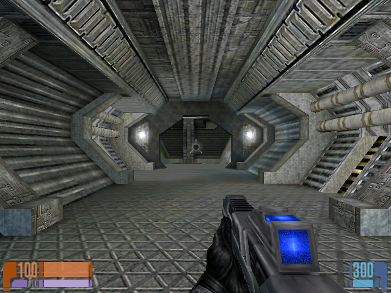
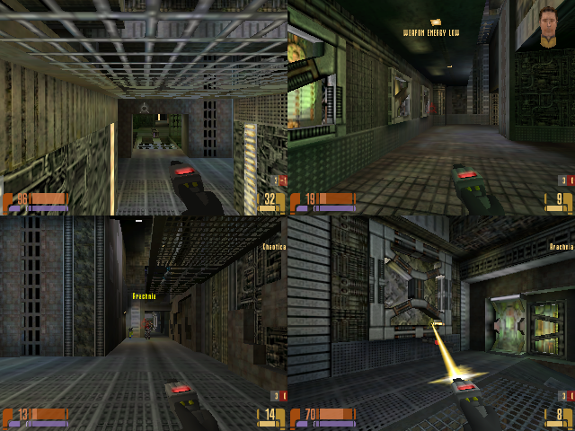
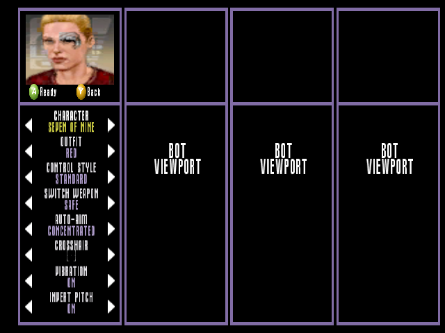

# Star Trek: Elite Force X

Star Trek: Elite Force X brings the *Star Trek: Voyager – Elite Force*
campaign, two-player cooperative play, and local Holomatch to the original
Xbox. The active implementation uses one shared Xbox engine/runtime source
tree under `code/`:

docs/screenshots/box art.png

- `default.xbe` runs the campaign and cooperative personalities.
- `efmp.xbe` runs SP-hosted Holomatch.
- Both executables use one `BaseEF` runtime.
- `codemp/` is historical and must not become an active dependency.

The long-term product target is a normal campaign plus PS2-parity menus,
two-player co-op, and gapless three/four-player Holomatch with unique controls,
bots, and the shared native D3D8 renderer. Work paused during the standard-SP
stability and performance pass after the Holomatch and Voyager Crew work.

## Screenshots



| Four-player Holomatch | Bot-backed four-viewport test setup |
| --- | --- |
|  |  |

## Required Local Dependencies

The active build is path-sensitive. Restore or update the scripts before
building if these paths change.

| Purpose | Required checkpoint path |
| --- | --- |
| Clean Xbox SDK | `C:\XDK_5558\XDK` |
| Xbox compiler/linker | `C:\XDK_5558\XDK\xbox\bin\vc71` |
| Xbox headers/libraries/tools | `C:\XDK_5558\XDK\xbox\include`, `xbox\lib`, `xbox\bin` |
| VS2005 MASM | `C:\Program Files (x86)\Microsoft Visual Studio 8\VC\bin\ml.exe` |
| Retail Bink Xbox library | `Z:\Programming\RM4+JadeSrc\Libraries\GX8\bink\binkxbox.lib` |
| Private EF runtime seed | `third_party_private\elite-force-runtime\BaseEF` |
| Canonical extracted runtime | `C:\Games\Emulators\stefx_iso_seed_complete` |
| XISO tool | `C:\nxdk\tools\extract-xiso\build\extract-xiso.exe` |
| XEMU executable | `C:\Games\Emulators\Xemu\xemu.exe` |
| XEMU test instance | `C:\Games\Emulators\Xemu\JACodex` |
| Python | `python.exe` on `PATH` |
| Audio conversion | `ffmpeg.exe` on `PATH` |

Use the unmodified XDK 5558 tree for the compiler, headers, libraries, shader
assembler, and `imagebld`. Do not mix it with the modified `C:\XDK` 5849 tree.
The production renderer links retail `d3d8.lib`; `d3d8i.lib` is diagnostic-only
and previously reduced the measured baseline.

The root retail ISO and all runtime game data are intentionally ignored by Git.
They must come from a legally obtained copy. The current package process also
depends on the preserved private DDS seed. Source alone is not sufficient to
produce a playable XISO.

Useful local source oracles are `Z:\Programming\UC2004` for a shipping Xbox
split-screen implementation, `C:\Programming\GitHub\UnrealTournament_1.40`
as a work-in-progress idea net, and `Z:\Programming\RM4+JadeSrc` for the Bink
reader/library integration. They are references, not authorities to copy
blindly.

## Build and Package

Run from the repository root in PowerShell. The only active combined build is:

```powershell
& .\scripts\build_xbox.ps1 -Target spmp -Clean
```

This performs a normal SP pass followed by the SP-hosted Holomatch pass and
refreshes:

```text
build\release\default.xbe
build\release\efmp.xbe
build\release\BaseEF\xbox0.pk3
build\release\BaseEF\xbox1.pk3
build\release\BaseEF\soundbank\sound.bnk
```

The audio build is deliberately all-XBADPCM. Stock WAV files take precedence;
MP3 is only an input when no matching stock WAV exists. Every emitted runtime
WAV must have format tag `0x0069`. Do not revert this policy. Music is packaged
as loose XBADPCM WAV, and clean stages must contain no MP3 files.

FMVs use the existing retail Bink reader directly. The package must contain all
42 original BIK files. Do not create or substitute XMV files.

Create a standard, marker-free, normal-boot XISO without running XEMU:

```powershell
& .\scripts\run_sp_xemu_smoke.ps1 `
  -CleanReleaseIso `
  -Iso .\build\xemu\StarTrekEliteForceX_standard.iso
```

If qualification is explicitly resumed later, smoke the immutable standard
image without screenshots or injected input:

```powershell
& .\scripts\run_sp_xemu_smoke.ps1 `
  -Iso .\build\xemu\StarTrekEliteForceX_standard.iso `
  -ImmutableIso -NormalBoot -NoScreenshots -Duration 210
```

The current user request is archival: do not run another bounded performance
experiment as part of restoring or validating this checkpoint.

## Current Generated-Build Identity

Generated files are not in Git. These hashes identify the last local build and
are preserved in the external archive for comparison:

| Artifact | Build ID / size | SHA-256 |
| --- | --- | --- |
| `default.xbe` | `Aug 31 2026 11:02:53`, 4,710,400 bytes | `BC743355FCEBDE994DA3EC8D5CEEBC07AB7A4AA096D3592D9F1A43044FF30E98` |
| `efmp.xbe` | `Aug 31 2026 05:51:54`, 4,521,984 bytes | `8441023FB6A85B448127D8923CB34D542EA3F6FDF455271C7BAC50D0F5F30A2E` |
| `xbox0.pk3` | 323,527,910 bytes | `695FF971410A357BABAD1D8965AC20997C9DE411A46356C5CCEE2FC1131DE68E` |
| `xbox1.pk3` | 256,785,250 bytes | `C036F9567280E87F7C34227B32C08AC71DF6EC07C80A87C360D9BCEE4EA1D1D6` |

The final local soundbank manifest reported `encoding=xbadpcm`, 8,429 records,
8,429 encoded records, zero preserved PCM records, and 597,835,610 bytes.

There is no retained standard XISO in this checkpoint. The only XISO remaining
in the checkout at archival time was a disposable direct-`borg1` diagnostic
image and must not be mistaken for a release package.

## What Is Implemented

The shared native D3D8 renderer builds both personalities. Standard SP boots
normally; menu-to-Holomatch XBE handoff is restored; no production one-pad bot
hardwire remains. Save/load, pause Configure return, audio Cancel/Accept,
screen-size persistence, quit confirmations, and the zero-margin viewport
contract are implemented. FMV playback is visually accepted, the complete BIK
set is retained, Borg movement sounds were heard, and the tutorial health
terminal was user-confirmed fixed.

Holomatch can render two-, three-, and four-player local layouts. Three-player
uses the same three-plus-player quality policy as four-player, and adjacent
viewports have zero-width seams. The diagnostic one-pad mode can assign bots
literally to P2-P4 or P2-P3, but production menu flow is restored. Separate
views, HUD/status routing, cameras, weapons, bot movement, and exact bot counts
have XEMU evidence. Physical two/three/four-pad assignment and final retail
hardware qualification remain open.

The PS2-style main frontend, Holomatch flow, Voyager Crew screens, Hazard Suit
diagram, and Voyager diagram are implemented in `code/ui/ui_ef_frontend.cpp`.
The PS2 reference captures needed for pixel matching are tracked under
`notes/ps2_menu_references`.

## Known Failures and Unqualified Work

This checkpoint is not shippable. The last human reports must remain the
authority even where later source changes attempted a fix.

The Hazard Suit and U.S.S. Voyager diagrams were a hard visual failure in the
last human review: alignment and vector pointers were not pixel-perfect, and
Voyager's nose was clipped. Later coordinate and vector-line changes exist but
were not human-qualified. The loading wheel was still in the wrong position,
and the delay between selecting Tutorial/Engage and seeing the loading screen
remained objectionable. Source changes attempted to present the load screen
earlier and place the wheel at equal left/bottom margins, but there is no valid
runtime screenshot proving the result.

The tutorial repeatedly froze when reaching the first enemy. A later no-input
smoke remained alive for 120 seconds but never exercised that encounter, so it
does not close the bug. Alternate fire previously locked the game and also
remains unqualified. The Borg distribution node was missing part of its
texture; packaging now retains a 256x256, single-level DXT5 version, but the
fix lacks human visual confirmation.

VO still sounded muddy to the user even though the stock WAV/MP3 sources did
not. Munro's first line after tapping his comm badge in `borg1`
(`sound/voice/munro/cin/01/ivebeencutoff.wav`) was skipped. The final all-XBADPCM
asset is byte-identical to the stock XBADPCM WAV and the engine now defers and
retries unloaded one-shot voice channels, but the exact line and perceived
quality were not human-confirmed after that change. Do not blame encoding again
without evidence; XBADPCM for all runtime sound is a fixed project decision.

Co-op remains incomplete. Character/difficulty/new/load menu flow, distinct
one/two-player HUDs, reliable hardware logging, natural cinematic transition,
and representative performance/control/audio qualification are still open.

## Honest Performance Status

No claim of consistent 30 FPS is justified.

The final tutorial smoke averaged 87.5 internal FPS, but it observed a nearly
empty cube and is not a representative benchmark. The interrupted `borg1` run
spent much of its opening looking at the flat intro panel and still fell to
22.0–25.7 internal FPS. Across 25 samples it averaged 51.1 internal FPS with a
22.0 p10 and five samples below 30; wall-rate samples averaged 33.6 FPS with a
21.6 p10 and twelve of twenty-four below 30. Zone free memory declined from
about 6.3 MiB to 2.94 MiB and the largest free block from about 4.0 MiB to
2.06 MiB during the run. That correlation is not proof that memory is the
cause. The run was stopped by the user and did not qualify gameplay.

Four-player Holomatch has much better short XEMU results, but its retained
ten-minute host soak averaged 39.8 internal FPS, reached 26.2, and had three of
forty-seven samples below 30. Earlier retail hardware samples averaged roughly
20 FPS. Co-op was observed around 15 FPS on hardware. Retail Xbox remains the
shipping authority.

The next iteration must not use tutorial cubes, intro panels, or early-map
views as proof. It should freeze features, establish a reproducible
post-cutscene combat save, compare a clean baseline, and separately measure CPU
frame time, D3D device waits/submission, texture residency/uploads, sound-buffer
residency, and allocator growth. If no discrete defect explains the result,
treat it as an architectural cache/streaming/content-budget problem rather than
continuing speculative micro-patches.

## Non-Negotiable Engineering Rules

ICARUS scripts own task sequencing, spawns, AI state, cameras, dialogue waits,
and map progression. Never write production code that supersedes, bypasses,
compensates for, or re-times authored ICARUS behavior. Fix the responsible
engine contract instead.

Elite Force uses MDR models in the relevant player paths. Ghoul2 is not the
Holomatch workload and must not be presented as an Elite Force optimization.
Changes intended for four-player operation must also apply to three-player
unless a measured reason proves otherwise.

Never use Computer Use, Codex Capture, desktop automation, remote input, or
simulated keyboard/mouse/controller input. Keep harnesses isolated to the game
and diagnostic-only, use file/log/terminal inspection, never bring XEMU to the
foreground, use XEMU-native screenshots only when explicitly needed, minimize
captures, and close XEMU after every run.

The canonical controller configuration at
`C:\Games\Emulators\CXBX\Star-Trek-Elite-Force-X\BaseEF\default.cfg` is
read-only. Do not edit, stage, overwrite, or generate it.

Run `scripts\cleanup_generated.ps1` before and after completed build/package
cycles. Keep one current XISO at most. Never commit runtime game data, XDK
files, generated XBEs/PK3s/ISOs, logs, screenshots, or private dependencies.

## License

Source derived from released Raven Software code remains subject to GNU GPLv2
under `LICENSE.txt`. Retail game data, Xbox SDK material, Bink libraries, BIOS,
EEPROM, and generated runtime packages are not distributed by this repository.
